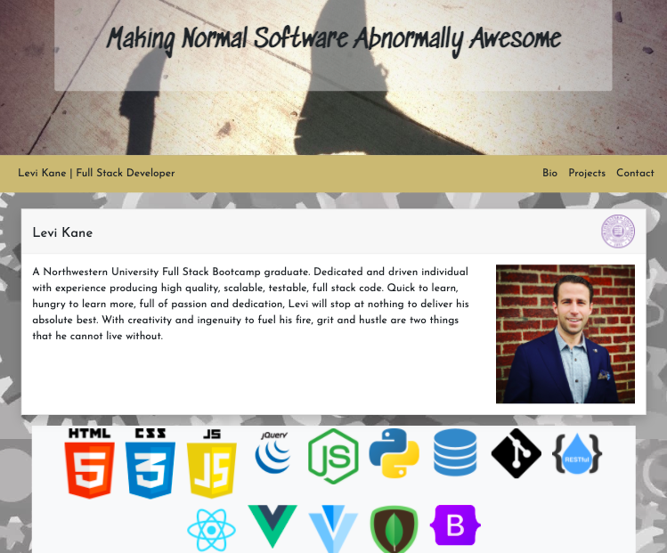

# Portfolio

## Description

This appication was built with React. It is used to display all of my coding projects to be compiled nicely in a portfolio. It is structured to easily add and delete projects by simply accessing the projectData.json file. A live link of the website can be viewed [HERE!](https://levickane.github.io/reactportfolio/)

## Table of Contents

- [Installation](#Installation)
- [Usage](#Usage)
- [License](#License)
- [Questions](#Questions)

## Installation

In order to run the program, you'll first have to fork the repo. In the terminal you'll run npm install to install all dependencies.

## Usage

While in the project's root folder, in the terminal, you'll type

    npm start

and React will launch a new window in your browser at localhost:3000

## License

None

## Badges

## Questions

If you have any questions, reach out to me through my [Github](www.github.com/levickane) .
